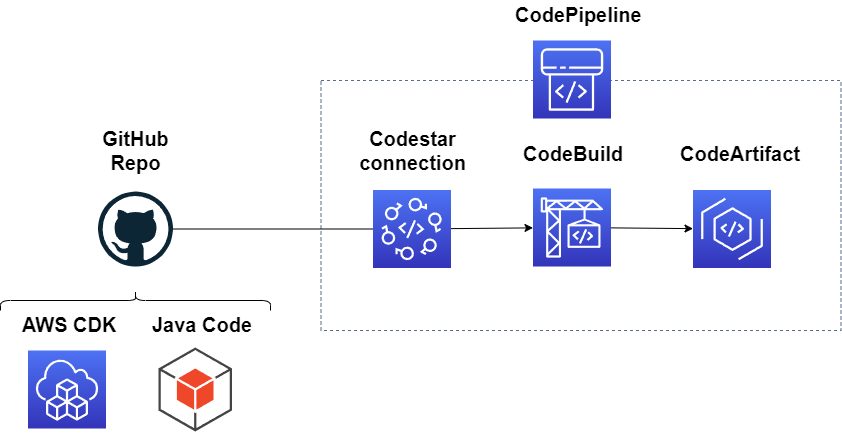
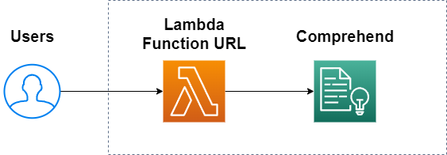
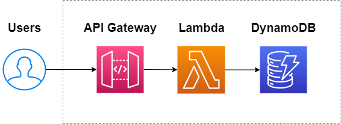

# draw-io

- [AWS CDKによるCodeArtifact上のMavenリポジトリへのCICDパイプライン](https://qiita.com/yoyoyo_pg/items/1647d65f5b4ae4ae4270)

---

- [LambdaとComprehendを利用した感情分析API](https://qiita.com/yoyoyo_pg/items/5fe616bc5c6fd00ac425)

---

- [はじめて作成したWeb API](https://qiita.com/yoyoyo_pg/items/39c6100646b4526be60d)

